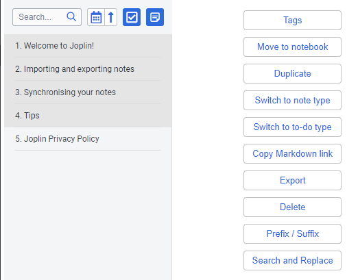

# Joplin Plugin: Note Rename by Regular Expression

> [!NOTE]
> This a forked version of the [Note Rename](/cuibonobo/joplin-plugin-note-rename)
> plugin where the search and replace feature was enhanced to support
> regular expressions.

Rewrite [Joplin](https://joplinapp.org/) note titles in bulk by
regular expression search and replace.

## Usage

This plugin works by altering the titles of the currently-selected
notes. Select some notes in the notes list and two buttons will appear
in the notes list toolbar: `Search and Replace Regex`.

There are similar options in the **Tools** menu and the right-click
context menu for the selected notes. Click the button or menu item for
the operation you'd like to perform.

### `Search and Replace Regex`

This command will search the selected notes for the regular expression
in the **Search** input box. It will then replace that text with the
value of the **Replace** input box.

To perform the operation, click **OK**. If you've changed your mind,
click **Cancel**.

## Plugin Development

### Building the plugin

The plugin is built using webpack, which creates the compiled code in
`/dist`. A JPL archive will also be created at the root, which can use
to distribute the plugin.

To build the plugin, simply run `npm run dist`.

The project is setup to use TypeScript, although you can change the
configuration to use plain JavaScript.

### Updating the plugin framework

To update the plugin framework, run `npm run update`.

In general this command tries to do the right thing - in particular
it's going to merge the changes in package.json and .gitignore instead
of overwriting. It will also leave "/src" as well as README.md
untouched.

The file that may cause problem is "webpack.config.js" because it's
going to be overwritten. For that reason, if you want to change it,
consider creating a separate JavaScript file and include it in
webpack.config.js. That way, when you update, you only have to restore
the line that include your file.

## License

[CC0](./LICENSE)
